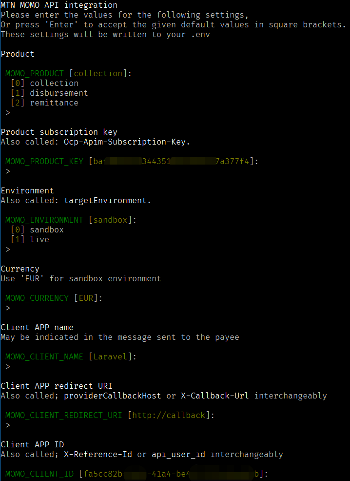

## Laravel MTM Momo API Integration

[](https://packagist.org/packages/bmatovu/laravel-mtn-momo)
[](https://packagist.org/packages/bmatovu/laravel-mtn-momo)
[](https://packagist.org/packages/bmatovu/laravel-mtn-momo)
[](https://travis-ci.org/mtvbrianking/laravel-mtn-momo)
[](https://scrutinizer-ci.com/g/mtvbrianking/laravel-mtn-momo/?branch=master)
[](https://github.styleci.io/repos/175959117)

### Introduction

This package offers everything you need to integrate the [MTN MOMO API](https://momodeveloper.mtn.com) in your Laravel application. It provides a wrapper around the core MTN Momo API services, leaving you to worry about other parts of your application.

### [Installation](https://packagist.org/packages/bmatovu/laravel-mtn-momo)

To get started, install the package via the Composer package manager:

```
composer require bmatovu/laravel-mtn-momo
```

Next, for Laravel 5.3, 5.4; you need register the package service provider in the providers array of your `config/app.php` configuration file. For later Laravel versions, this package is auto-discoverable.

```php
'providers' => array(
    // ...
   Bmatovu\MtnMomo\MtnMomoServiceProvider::class,
),
```

**Configuration customization**

If you wish to customize the default configurations, you  may export the default configuration using

`php artisan vendor:publish --provider="Bmatovu\MtnMomo\MtnMomoServiceProvider" --tag="config"`

### Database Migration

The package service provider registers its own database migrations with the framework, so you should migrate your database after installation. The migration will create a tokens tables your application needs to store access tokens from MTN MOMO API.

```
php artisan migrate
```

### Prerequisites

You will need the following to get started with you integration...

1. Create a [**developer account**](https://momodeveloper.mtn.com/signup) with MTN MOMO.
2. Subscribe to a [**product/service**](https://momodeveloper.mtn.com/products) that you wish to consume.

### Bootstrapping

Now you need to run the `mtn-momo:init` command. This command will create the necessary settings in you're `.env` file as you walkthrough the steps. These settings are needed for authentication and communication with the MTN MOMO API.

```
php artisan mtn-momo:init
```



The package is equipped with [more Artisan commands](#more-artisan-commands) that will ease your work.

### Usage

[Test numbers](https://momodeveloper.mtn.com/api-documentation/testing/#testing)

```php
use Bmatovu\MtnMomo\Products\Collection;

$collection = new Collection();

// Request a user to pay
$collection->transact('EXT_REF_ID', '07XXXXXXXX', 100);
```

**Exception handling**

```php
use Bmatovu\MtnMomo\Products\Collection;
use Bmatovu\MtnMomo\Exceptions\CollectionRequestException;

try {
    $collection = new Collection();
    
    // Request a user to pay
    $collection->transact('EXT_REF_ID', '07XXXXXXXX', 100);
} catch(CollectionRequestException $e) {
    do {
        printf("\n\r%s:%d %s (%d) [%s]\n\r", 
            $e->getFile(), $e->getLine(), $e->getMessage(), $e->getCode(), get_class($e));
    } while($e = $e->getPrevious());
}
```

**Logging**

Often you might need to log your API requests for debugging purposes. You can adding logging via [Guzzle middleware](http://docs.guzzlephp.org/en/stable/handlers-and-middleware.html#middleware);

```php
use Monolog\Logger;
use GuzzleHttp\Middleware;
use GuzzleHttp\MessageFormatter;
use Monolog\Handler\StreamHandler;+

$logger = new Logger('Logger');
$streamHandler = new StreamHandler(storage_path('logs/mtn-mono.log'));
$logger->pushHandler($streamHandler);
$format = "\r\n[Request] {request} \r\n[Response] {response} \r\n[Error] {error}.";
$messageFormatter = new MessageFormatter($format);
$logMiddleware = Middleware::log($logger, $messageFormatter);

$collection = new Collection();

$collection->push($logMiddleware);

// Request a user to pay
$collection->transact('EXT_REF_ID', '07XXXXXXXX', 100);
```

**Dive in**: [Source code documentation](https://mtvbrianking.github.io/laravel-mtn-momo)

### More Artisan commands

- Register client APP ID.

`php artisan mtn-momo:register-id`

- Validate client APP ID.

`php artisan mtn-momo:validate-id`

- Request client APP secret.

`php artisan mtn-momo:request-secret`

<hr/>

I Need help!
---
Feel free to [open an issue](https://github.com/mtvbrianking/laravel-mtn-momo/issues/new). Please be as specific as possible if you want to get help.

Reporting bugs
--
If you've stumbled across a bug, please help us by leaving as much information about the bug as possible, e.g.
- Steps to reproduce
- Expected result
- Actual result

This will help us to fix the bug as quickly as possible, and if you wish to fix it yourself feel free to [fork the package](https://github.com/mtvbrianking/laravel-mtn-momo) and submit a pull request!
